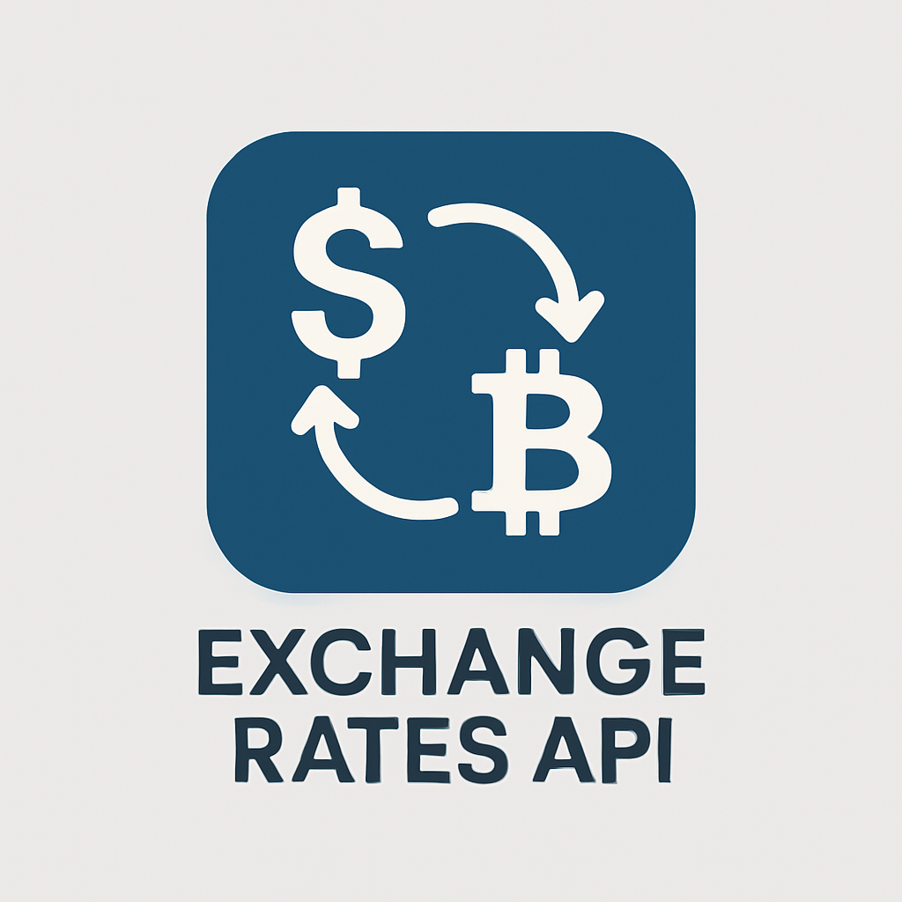
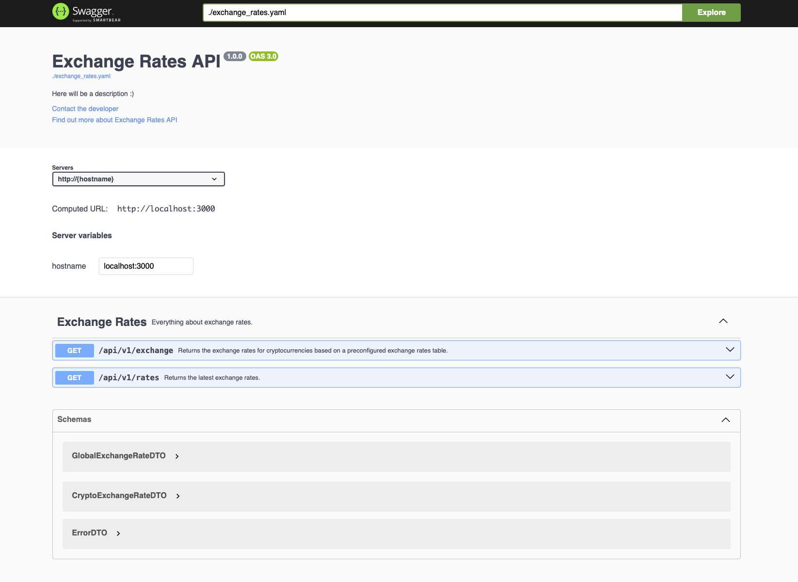
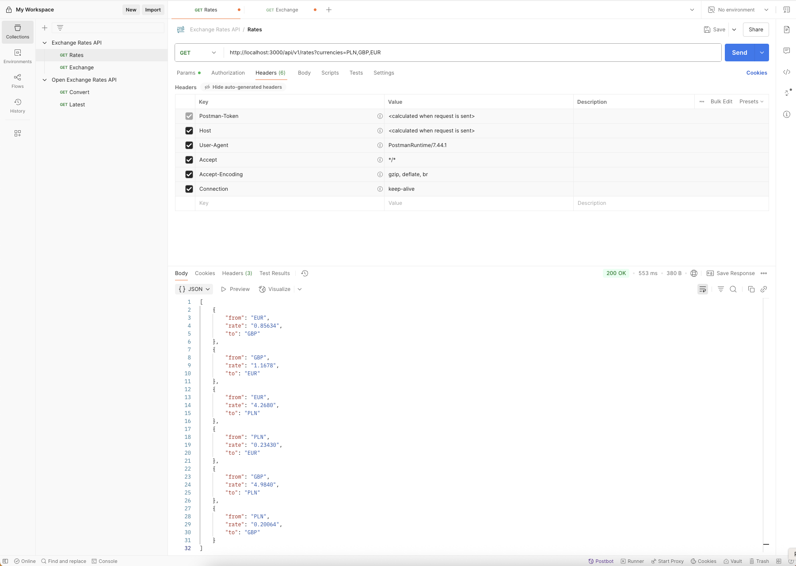
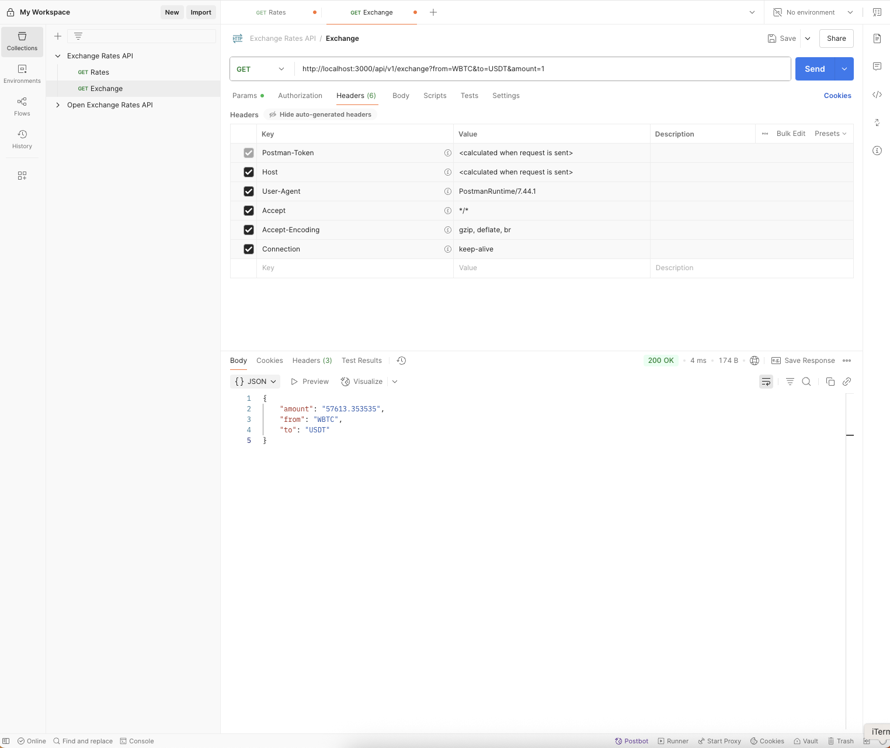

<div align="center" style="max-width: 800px; margin: auto;">
  
</div>

# Exchange-Rates-API 💱

This project is a web application that provides basic functionality for calculating exchange rates between global and cryptocurrency currencies. It integrates with the `openexchangerates.org` API to fetch the latest exchange rates for a given, comma-separated list of currencies.
The application's structure is intended to demonstrate a scalable and extensible design, allowing for the addition of new business features and advanced techniques to enhance scalability and fault tolerance. 


## 🔄 `GET /api/v1/convert`

Returns the exchange rate for a specified cryptocurrency pair (`from` → `to`) and amount using a preconfigured exchange rates table.

### Query Parameters

| Name   | Type   | Required | Description                                      | Default |
|--------|--------|----------|--------------------------------------------------|---------|
| `from` | string | ✅       | Source cryptocurrency code                       | `WBTC`  |
| `to`   | string | ✅       | Target cryptocurrency code                       | `USDT`  |
| `amount` | number | ✅    | Amount of the source cryptocurrency to exchange  | `1`     |

✅ **Success Response (200)**

Returns a JSON of exchange rate.

```json
{
    "from": "WBTC",
    "rate": "57613.353535",
    "to": "USDT"
}
```


## 📈 `GET /api/v1/rates`

Returns the latest exchange rates for a list of currencies using a default base currency and the cross-rate formula.

### Query Parameters

| Name   | Type   | Required | Description                                      | Default |
|--------|--------|----------|--------------------------------------------------|---------|
| `currencies` | string | ✅       | Comma-separated list of currency codes. At least two currencies are required.   | `EUR,PLN`  |

✅ **Success Response (200)**

Returns a JSON array of exchange rate objects.

```json
[
    {
        "from": "EUR",
        "rate": "4.2809",
        "to": "PLN"
    },
    {
        "from": "PLN",
        "rate": "0.23360",
        "to": "EUR"
    },
    {
        "from": "EUR",
        "rate": "1.1524",
        "to": "USD"
    },
    {
        "from": "USD",
        "rate": "0.86772",
        "to": "EUR"
    },
    {
        "from": "PLN",
        "rate": "0.26921",
        "to": "USD"
    },
    {
        "from": "USD",
        "rate": "3.7146",
        "to": "PLN"
    }
]
```


## Configuration ⚙️

The default configuration can be found in the `config.yaml` file in the root directory.

```yaml
server:
  addr: 0.0.0.0
  port: 3000 
open_exchange_rates_api:
  app_id: YOUR_APP_ID
  base_url: https://openexchangerates.org/api
```

To successfully integrate with the _openexchangerates.org API_, please follow the authentication [guide](https://docs.openexchangerates.org/reference/authentication) and replace the `app_id` value with your own.

## Taskfile 🧰

This project utilizes the [Task](https://taskfile.dev) runner/build tool to simplify and speed up the testing and development process. According to the [installation guidelines](https://taskfile.dev/installation/), ensure that everything has been installed successfully in your environment by running: `task --help`

To display all available commands, run: `task`

```
task: [default] task --list
task: Available tasks for this project:
* build-image:               Build HTTP server Docker image using Dockerfile definition.
* bundle-openapi:            Bundle OpenAPI spec and regenerate code.
* clean:                     Clean up generated Swagger files and stop containers.
* default:                   List all available tasks.
* env-down:                  Stop Swagger UI, Exchange Rates HTTP Docker containers.
* env-up:                    Validate and serve Swagger UI, Exchange Rates HTTP via Docker Compose.
* gen-code:                  Generate server code and models from OpenAPI spec.
* install-swagger-cli:       Install swagger-cli globally via npm.
* test:                      Run all unit tests with strict settings.
```

## Docker 🐳

Ensure that your [Docker](https://docs.docker.com/desktop/) installation is working correctly before running the application environment. The `Dockerfile` and `docker-compose` files are available in the root directory of the repository.

### First-time local environment run 

Before running the `docker compose up` command, esnure that the application image has been successfully built and commited by running the `task build-image` command. 

> [!IMPORTANT]  
> Please ensure that the Swagger CLI is installed on your machine.  
> To install the client, run `task install-swagger-cli` and verify the installation by running `swagger-cli -v`.

🚀  Use `task run-env` to automatically spin up the application environment.

```Docker
[+] Running 2/2
 ✔ Container exchange-rates-api-swagger-ui-1  Running                                                                                                                                      0.0s 
 ✔ Container exchange-rates-api-go-webapp-1   Started    
 ```

🔍  Use `docker ps` to verify the state of running containers.
****
```Docker
CONTAINER ID   IMAGE                   COMMAND                  CREATED          STATUS          PORTS                            NAMES
19756280c322   micgos-web-app          "./micgos-web-app --…"   2 minutes ago    Up 2 minutes    0.0.0.0:3000->3000/tcp           exchange-rates-api-go-webapp-1
e627e6b04358   swaggerapi/swagger-ui   "/docker-entrypoint.…"   18 minutes ago   Up 18 minutes   80/tcp, 0.0.0.0:8080->8080/tcp   exchange-rates-api-swagger-ui-1
```

## OpenAPI (Swagger) 📘

This project follows the [OpenAPI](https://swagger.io/docs/specification/v3_0/about/) standard and utilizes the `oapi-codegen` tool to automatically generate a *Go HTTP server* along with response models from the provided [specification](./api/openapi/exchange_rates.yaml).

🌐 To get the list of all available HTTP API endpoints, ensure that the environment is running and navigate to http://localhost:8080.

<div align="center" style="max-width: 800px; margin: auto;">
  
</div>

## Example HTTP request and responses ⭐

<div align="center" style="max-width: 800px; margin: auto;">
  
</div>

_____

<div align="center" style="max-width: 800px; margin: auto;">
  
</div>